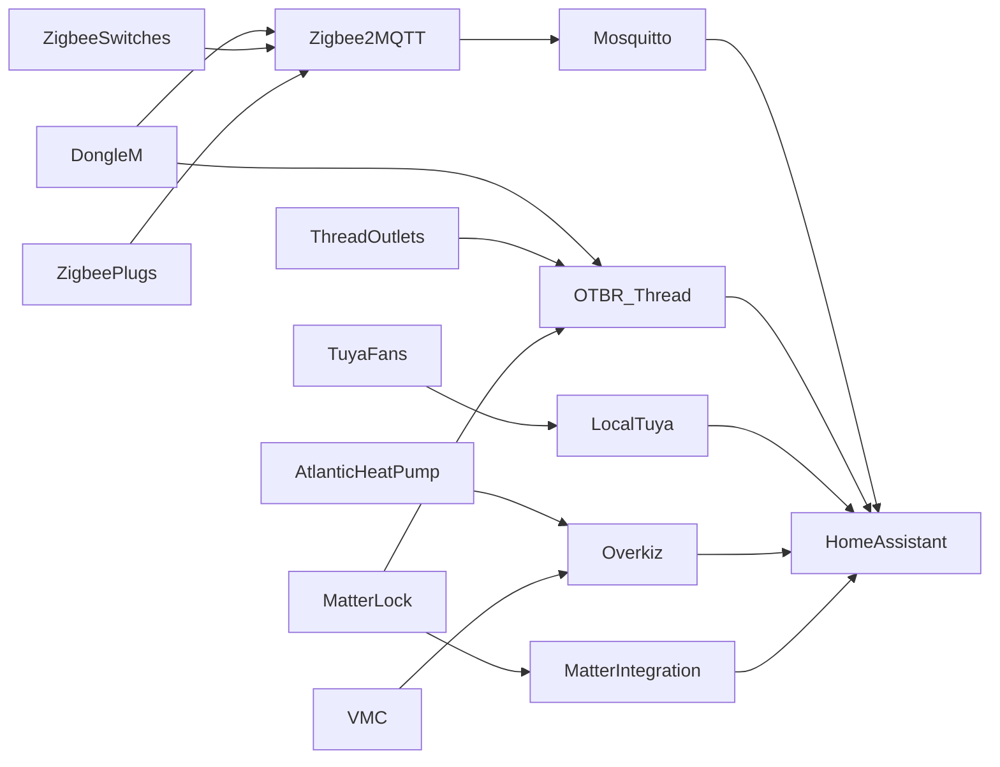

# Home Assistant PoC

Local-first home automation study. Vendor-agnostic (Zigbee, Wi-Fi, Thread, Matter). Self-hosted on a Mini PC. This repo tracks **system pieces and how they interact** — not app configs or Compose yet.

## Philosophy

- Control stays in the house.
- Mix protocols; prefer local integrations over cloud when practical.
- Start with essentials; garden waits until 2026.

## Docs

| File | What it is |
|------|------------|
| [IMPLEMENTATION.md](IMPLEMENTATION.md) | Gradual install roadmap (plan of record) |
| [pieces/server.md](pieces/server.md) | Mini PC / Debian / Docker host |
| [pieces/network.md](pieces/network.md) | DHCP reservations, IP plan |
| [pieces/radio.md](pieces/radio.md) | Dongle, Zigbee2MQTT, MQTT, Matter/Thread |
| [pieces/switches.md](pieces/switches.md) | Zigbee wall modules; mesh + light/fan |
| [pieces/outlets.md](pieces/outlets.md) | Zigbee plugs + Matter-over-Thread outlets |
| [pieces/fans.md](pieces/fans.md) | Tuya fans → LocalTuya; season/hour/temp automations |
| [pieces/heat-pump.md](pieces/heat-pump.md) | Atlantic heat pump |
| [pieces/vmc.md](pieces/vmc.md) | Mechanical ventilation |
| [pieces/energy.md](pieces/energy.md) | Consumption view + away shedding |
| [pieces/lighting.md](pieces/lighting.md) | Bulbs, motion, switch scenes |
| [pieces/security.md](pieces/security.md) | Lock, doorbell/cameras, Thread TBR |
| [pieces/garden.md](pieces/garden.md) | 2026 irrigation + PoE Zigbee |
| [pieces/remote-access.md](pieces/remote-access.md) | GrapheneOS Companion, Android/Xiaomi TV, DuckDNS / Meshnet |

## Interaction overview

Piece files own the edges; this diagram is the overview only.
